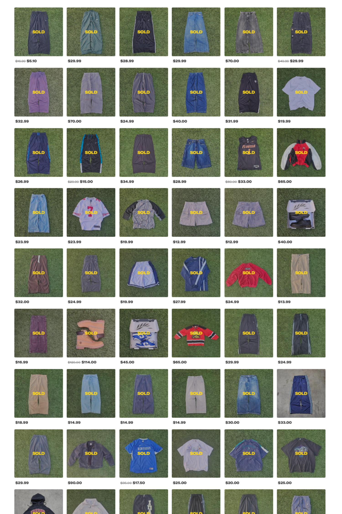

<h1>Depop Sales Dashboard: A Performance Breakdown - <a href="./DEPOPSALES_2024!.xlsm" download>Excel Sheet</a> </h1>

<h2>Description</h2>
This interactive dashboard analyzes sales performance for my personal Depop business, an online resale shop where I manage inventory, pricing, customer communication, and shipping logistics. The dashboard offers a detailed breakdown of key metrics such as monthly revenue, sales volume, and product category trends. Built to track and optimize real-world performance, the dashboard features dynamic filtering and clear visualizations to highlight sales trends over time and identify top-performing items. It provides valuable insights into customer purchasing behavior, ultimately supporting data-driven strategies to grow and manage my online retail business effectively. Full business process documentation can be found here: <a href="./Depop_ProcessDocumentation.pdf" download>Process Documentation</a> </h1>
 

<h2>Languages and Utilities Used</h2>

- <b>Excel</b>
- <b>PivotTables</b>
- <b>Slicers</b>

  

  <h1>Project Process</h1>

<table width="100%" style="table-layout: fixed;">
  <tr>
    <td align="center" valign="top" width="25%">
      

        
        <b>Data Collection</b>
         
        <h6 style="text-align: center; min-height: 150px; font-size: 2px;">
          This project is based on sales transaction data gathered from my own Depop business operations throughout 2024. Transfered and reconsoiled sales data from Depop to Excel.
             <a href="https://www.depop.com/moriojac/">My Depop Page</a>
        </h6>
      

    </td>
    <td align="center" valign="top" width="25%">
      

        
        <b>Data Cleaning and Preparation</b>
        <h6 style="text-align: center; min-height: 150px;">
          Data of all 340 sales from 2024 was manually entered into an Excel spreadsheet through a custom data validation system.
            
          Then the data was cleaned and standardized to ensure consistency across categories such as item type, date of sale, source of inventory and profit. This ensured the dataset was accurate, complete, consistent, and ready for analysis.
        </h6>
      

    </td>
    <td align="center" valign="top" width="25%">
      

        
        <b>Data Visualization & Storytelling</b>
        <h6 style="text-align: center; min-height: 150px;">
          Data is manipulated into 5 different interactive visualizations, with corresponding pivot tables, slicers, and graphs:
             Store: Displays profitability by original sourcing location to identify which sources generate the highest returns.
             Category: Displays sales performance by product category to identify top-selling item types.
             Date: Displays sales and revenue trends over time to identify peak months and seasonal patterns.
             Brand: Displays sales performance by brand to identify the most popular and profitable labels.
             Size: Displays sales distribution by clothing size to identify which sizes sell most frequently.
        </h6>
      

    </td>
    <td align="center" valign="top" width="25%">
      

        
        <b>Interpretation & Decision-Making</b>
        <h6 style="text-align: center; min-height: 150px;">
          The goal of this data is to generate insights that support the growth and efficiency of my personal Depop business, allowing me to interpret trends and make informed data-driven decisions.
            Insights from the data help me refine sourcing strategies, focus on the most profitable brands and categories, adjust pricing based on seasonal demand, and better   
         understand buyer behavior to increase overall sales performance.
        </h6>
      

    </td>
  </tr>
</table>
