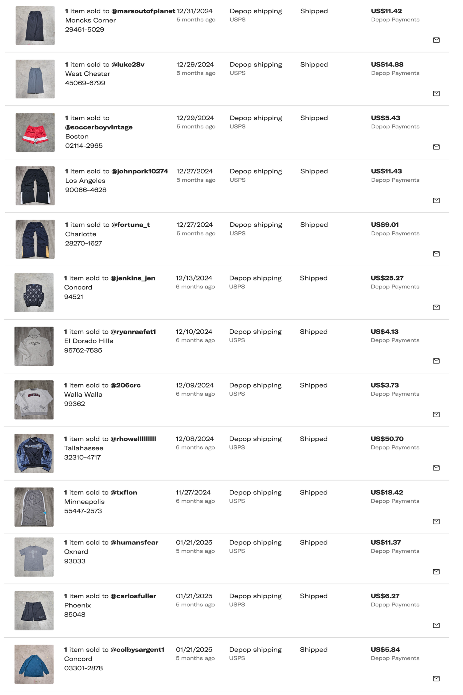
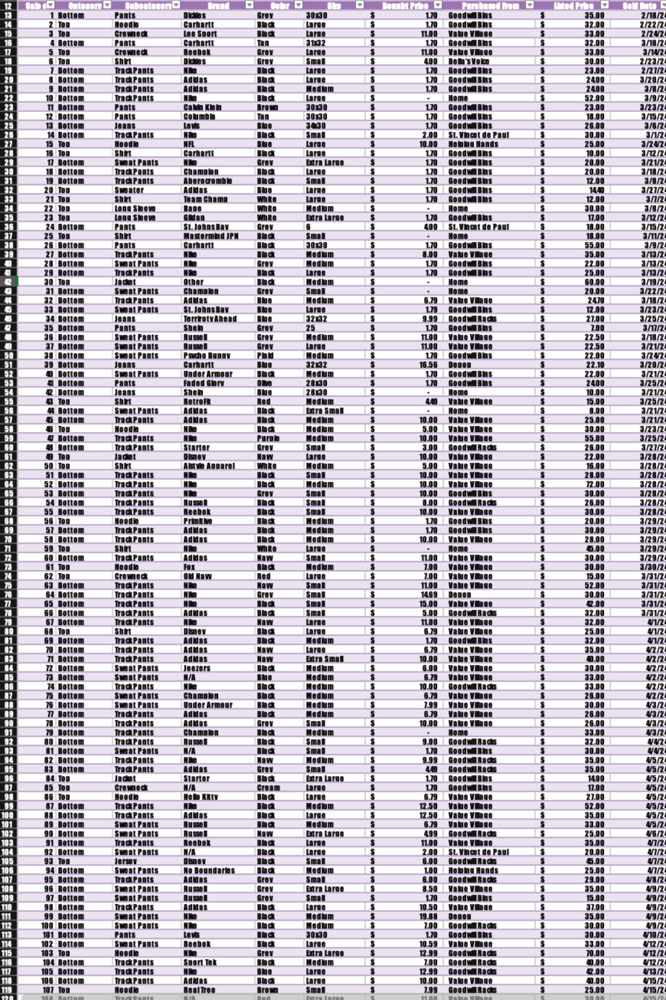
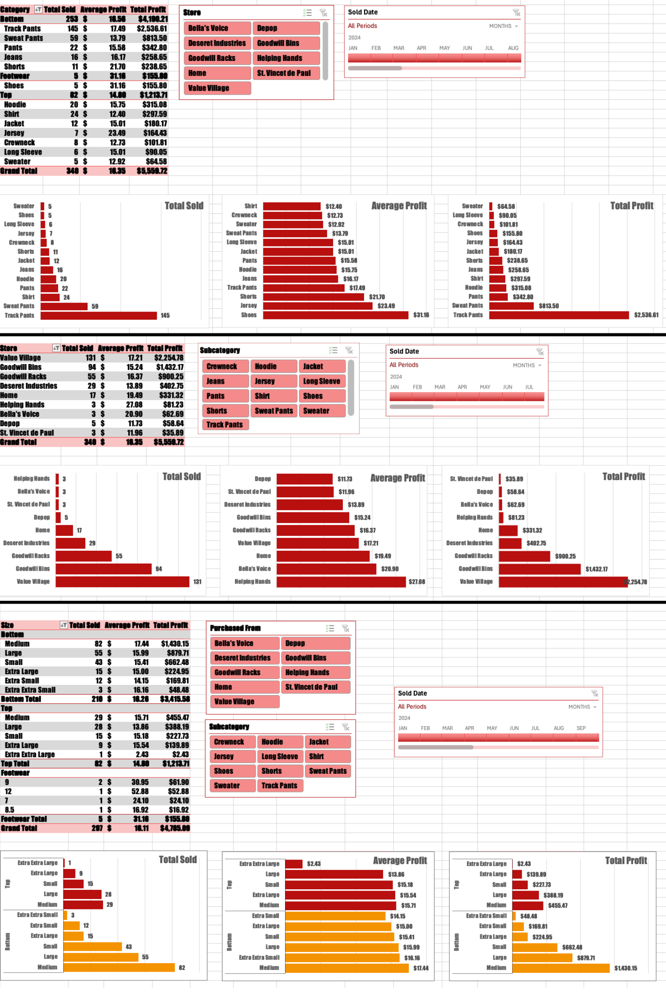

<h1>Depop Sales Dashboard: A Performance Breakdown - <a href="./DEPOPSALES_2024.xlsx" download>Excel Sheet</a> </h1>

<h2>Description</h2>
This interactive dashboard analyzes sales performance for my personal Depop business, an online resale shop where I manage inventory, pricing, customer communication, and shipping logistics. The dashboard offers a detailed breakdown of key metrics such as monthly revenue, sales volume, and product category trends. Built to track and optimize real-world performance, the dashboard features dynamic filtering and clear visualizations to highlight sales trends over time and identify top-performing items. It provides valuable insights into customer purchasing behavior, ultimately supporting data-driven strategies to grow and manage my online retail business effectively.  
 

<h2>Languages and Utilities Used</h2>

- <b>Excel</b> 

  

  <h1>Project Process</h1>

<table width="100%" style="table-layout: fixed;">
  <tr>
    <td align="center" valign="top" width="25%">
      

        
        <b>Data Collection</b>
         
        <h6 style="text-align: center; min-height: 150px; font-size: 2px;">
          This project is based on sales transaction data gathered from my own Depop business operations throughout 2024.
             <a href="https://www.depop.com/moriojac/">My Depop Page</a>
        </h6>
      

    </td>
    <td align="center" valign="top" width="25%">
      

        
        <b>Data Cleaning and Preparation</b>
        <h6 style="text-align: center; min-height: 150px;">
          - Grouping Dataset: Dataset was grouped by county and school year, preparing the data for summary operations within each county–school year combination.
            - Summarizing Dataset: Calculated and assigned the population percentage of each ethnic group for each county–school year combination.
            - Merging Datasets: Merged the dataset to include the geographic coordinates of each county to enable map visualization.
        </h6>
      

    </td>
    <td align="center" valign="top" width="25%">
      

        
        <b>Data Visualization & Storytelling</b>
        <h6 style="text-align: center; min-height: 150px;">
          Data is manipulated into several visualizations, categorized into two sections:
            - Map Search: Providing a comprehensive view of the racial disparities for each county, filterable by each race–school year combination.
            - Contrast: Revealing changes in racial demographics over time, filterable by county.
        </h6>
      

    </td>
    <td align="center" valign="top" width="25%">
      

        
        <b>Interpretation & Decision-Making</b>
        <h6 style="text-align: center; min-height: 150px;">
          The goal of this data is to offer insights that assist educators, policymakers, and researchers in understanding student population trends across Washington State, enabling 
          data-driven decision-making.
            Insights from the data can support the development of targeted educational strategies, such as resource allocation for underrepresented groups, district-level 
          planning, and policies that address racial disparities in enrollment over time.
        </h6>
      

    </td>
  </tr>
</table>
